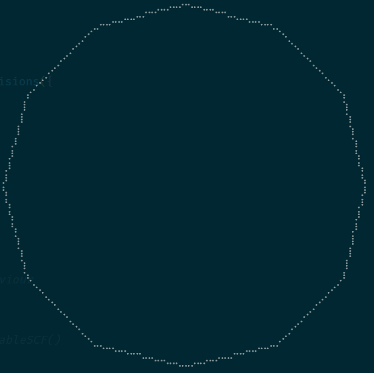
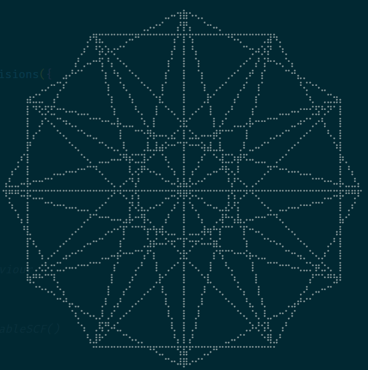
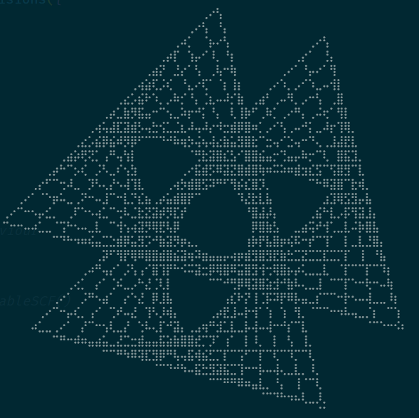
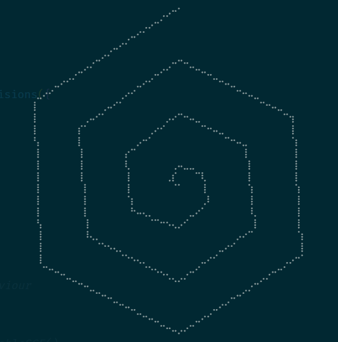

# String Art

This is the packaged up calculations which generate the polygons on [playingwithpolygons.com](https://www.playingwithpolygons.com/).

## What is String Art

Imagine a board with nails in it, each nail is an evenly spaced vertex on a 2D plane. We then take a string connecting these vertices to make lines forming a polygon. This is the fundamental idea that drives everything else that this library does.

Vertices are the original polygon.

Subdivisions are dividing the lines between vertices, which means putting another vertex in the middle of a line connecting two vertices. Turning what was one line, into two lines.

Points are how many vertices to count before connecting the line again. If points is two, every second vertex will be used; effectively halving the vertices used.

Jumps are a sequence of counting before connecting the line, similar to points. However this happen before the lines are subdivided; meaning they too can be subdivided creating vertices outside of the lines originally established by the original polygon.

## Example output from drawille demo file

This packages repo contains a `draw-cli-demo.ts` which you can review and run to generate the following below.






## Usage

Each instance exposes a `getVerticesMatrix()` which returns a vertices array shaped like `[{ x: number, y: number}]`. This array contains the vertices for the polygon to be drawn. Either using polygon or line graphic primitives.

On [playingwithpolygons.com](https://www.playingwithpolygons.com/) I used p5.js (Canvas) to create most of the visuals. However I also found it straight forward to apply the same data to SVG's.

It is also possible to make an animation of sorts by using `nGonSubdivisions.setPointsToNextStableSCF()` which will progress the shape to its next "stable" presentation. You can find an example of this on [playingwithpolygons.com's sequence viewer](https://www.playingwithpolygons.com/sequence)

### NGon

```ts
const NGonArt = new NGon({
  vertices: 12,
})
```

### NGonJumps

```ts
const JumpsArt = new NGonJumps({
  vertices: 12,
  jumps: [2, 5, 6],
})
```

### NGonSubdivisions

```ts
const SubdivisionArt = new NGonSubdivisions({
  vertices: 12,
  subdivisions: 14,
  points: 13,
  jumps: [3, 5],
})
```

### NGonSpirals

```ts
const SpiralArt = new NGonSpirals({
  vertices: 6,
  reduction: 20,
  showMirror: false,
  jumps: [],
})
```
